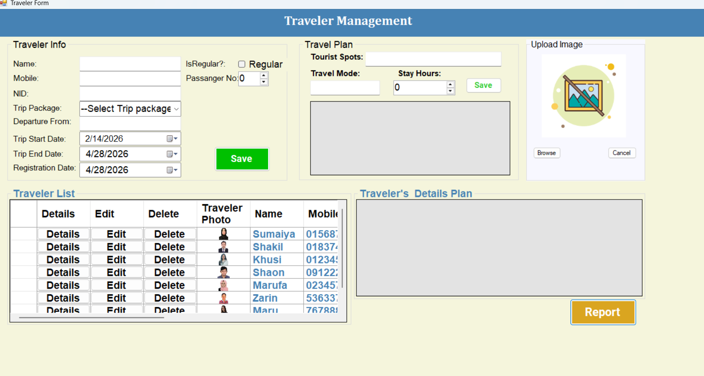
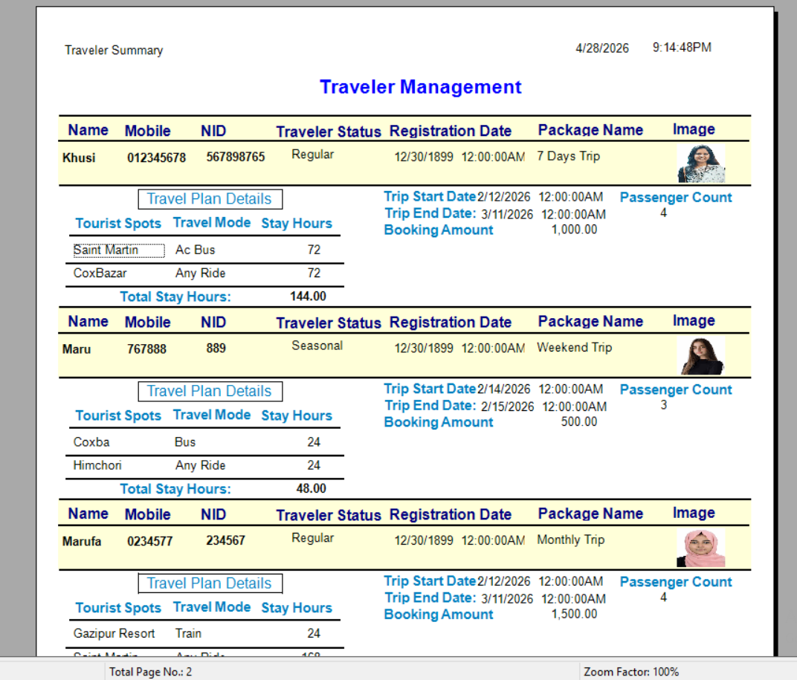
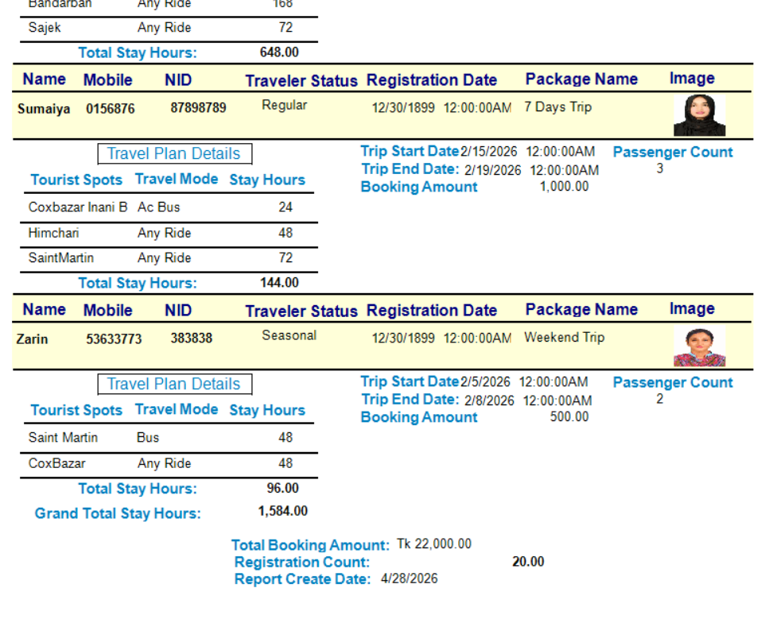

# Traveler-Management-ASP.NET-Web-Forms-with-ADO.NET-and-Crystal-Reports

A professional **Master-Detail CRUD** application designed to manage traveler registrations and complex trip itineraries. This project combines the power of **ASP.NET Web Forms**, **ADO.NET**, and **Crystal Reports** into one seamless system.

## 🖼️ Application Gallery

### 1. Main Dashboard
This is where you manage everything. You can fill out traveler info and add multiple trip destinations in one single form.

### 2. Professional Crystal Report
The system generates a clean, print-ready document for every traveler.

---

## 🌟 Key Features

* **All-in-One Form:** Save a Traveler (Master) and all their trip plans (Details) at once.
* **Safety First:** If a save fails, the system automatically cancels the whole process so your data stays clean (Transaction Rollback).
* **Live Photo Preview:** See the traveler’s photo immediately after selecting the file.
* **Dynamic Rows:** Add or remove trip destination rows instantly without refreshing the page.
* **One-Click Reporting:** Export traveler data into professional **Crystal Reports** instantly.

---

## 🛠️ Built With

| Tool | Purpose |
| :--- | :--- |
| **C# & ASP.NET** | The core logic and web structure. |
| **ADO.NET** | Fast and direct communication with the database. |
| **SQL Server** | Securely stores all travelers and trip details. |
| **jQuery & AJAX** | Makes the interface fast and interactive. |
| **Crystal Reports** | Generates high-quality, printable PDF-style reports. |

---

## 📁 Project Structure

* **DAL (The Gateway):** The direct link to your database. It handles the raw SQL commands.
* **Repository (The Middleman):** Organizes the data and passes it to the user interface.
* **ViewModels:** Custom classes that prepare data perfectly for the screen and reports.

---

## 🚀 Getting Started

1.  **Add Traveler:** Enter basic info like Name, Mobile, and NID.
2.  **Plan the Trip:** Add as many "Tourist Spots" as needed in the details table.
3.  **Save:** Click the **Save** button to store everything in a single transaction.
4.  **Export:** Click the **Report** button to generate the traveler's professional summary.

---
**Developed by Marufa Monjuri** *Focused on building robust, high-performance software solutions.*
